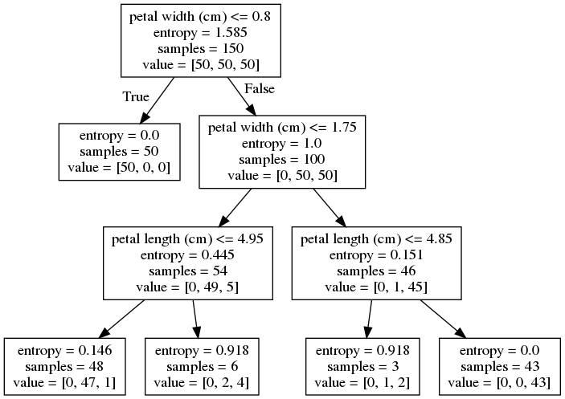

# ML2

# Отбор информативных признаков
## Генетический алгоритм

Информативные признаки - те, что наиболее сильно влияют на результаты обучаемой модели. Используя только оные,т.е, произведя отбор признаков и уменьшение их в исходном датасете, мы можем эффективно уменшить признаковое пространство, избавившись от ненужных данных, не теряя качества классификации, например, или не увеличивая ошибку в задачах регрессии. 

Генетический алгоритм начинается со стартовой популяции, которая состоит из набора хромосом (векторов - решений), где каждая хромосома имеет последовательность генов.

Ген в GA - строительный блок хромосомы. Для нашей задачи - гены и есть признаки. Задачи состоит в отборе оных. В используемом датасете находится 360 признаков, соответственно - 360 генов в хромосоме. Представление гена выберем бинарное (присутствует в хромосоме или нет). 


Используя функцию приспособленности, GA выбирает лучшие решения в качестве родителей для создания новой популяции, а "плохие" - "убивает". Новые решения в новой популяции создаются применением двух операций над родителями - кроссовер и мутация. 

Начальную популяцию (их хромосомное представление) мы инициализируем случайно. Это легко делается с помощью NumPy. 


Критерий для выбора родителей - значение приспособленности. Чем выше значение - тем лучше решение. Оно расчитывается с помощью функции приспособленности. Выбранная исходная модель - SVC - следовательно, мы отбираем признаки для улучшения точности классификации. Она же и будет критерием приспособленности того или иного решения. SVC будет обучаться на всех элементах обучающей выборки ТОЛЬКО с определёнными признаками.

#### Кроссовер и мутация
Опираясь на значение ФП, фильтруем решения, выбираем лучшие. GA предполагает, что совмещение двух хороших решений даст новое лучшее. Здесь и применяется кроссовер - обмен родителей определёнными генами. Был использован одноточечный кроссовер, в котором определённая точка разделяет хромосому. Гены перед оной берутся из первого решения, после - из второго. Новая популяция для новой итерации состоит из предыдущих родителей и их потомства. 


Мутации в данной реализации - случайное обращение некоторых генов.

### Реализация

Извлекаем данные из запакованного в pickle части датасета Fruits360 (содержит 2000 объектов с 360 признаками, 8 классов)

```python
f = open("dataset_features.pkl", "rb")
data_inputs = pickle.load(f)
f.close()

f = open("outputs.pkl", "rb")
data_outputs = pickle.load(f)
f.close()

num_samples = data_inputs.shape[0]
num_feature_elements = data_inputs.shape[1]
train_indices = numpy.arange(1, num_samples, 4)
test_indices = numpy.arange(0, num_samples, 4)
print("Number of training samples: ", train_indices.shape[0])
print("Number of test samples: ", test_indices.shape[0])

"""
Параметры GA:
    размер популяции
    размер пула для "спаривания"
    количество мутаций
"""

sol_per_pop = 8 # размер популяции
num_parents_mating = 4 # Количество родителей в пуле.
num_mutations = 3
# Определяем размеры популяции.
pop_shape = (sol_per_pop, num_feature_elements)
 
# Создание начальной популяции.
new_population = numpy.random.randint(low=0, high=2, size=pop_shape)
print(new_population.shape)
 
best_outputs = []
num_generations = 100 #количество итераций (поколений)
```

```python
for generation in range(num_generations):
    print("Generation : ", generation)
    # Рассчитываем приспособленность для каждой хромосомы в популяции
    fitness = GA.cal_pop_fitness(new_population, data_inputs, data_outputs, train_indices, test_indices)

    best_outputs.append(numpy.max(fitness))
    # Точность классификации лучшего решения данной популяции.
    print("Best result : ", best_outputs[-1])

    # Выбор лучших родителей.
    parents = GA.select_mating_pool(new_population, fitness, num_parents_mating)

    # Генерация следующего поколения с помощью кроссовера.
    offspring_crossover = GA.crossover(parents, offspring_size=(pop_shape[0]-parents.shape[0], num_feature_elements))

    # Применение мутаций.
    offspring_mutation = GA.mutation(offspring_crossover, num_mutations=num_mutations)

    # Создание новой популяции, родители + потомство.
    new_population[0:parents.shape[0], :] = parents
    new_population[parents.shape[0]:, :] = offspring_mutation
```
#### Методы в GA.py

```python
#Обучаем SVC на отобранных признаках
def cal_pop_fitness(pop, features, labels, train_indices, test_indices):
    accuracies = numpy.zeros(pop.shape[0])
    idx = 0

    for curr_solution in pop:
        reduced_features = reduce_features(curr_solution, features)
        train_data = reduced_features[train_indices, :]
        test_data = reduced_features[test_indices, :]

        train_labels = labels[train_indices]
        test_labels = labels[test_indices]

        SV_classifier = sklearn.svm.SVC(gamma='scale')
        SV_classifier.fit(X=train_data, y=train_labels)

        predictions = SV_classifier.predict(test_data)
        accuracies[idx] = classification_accuracy(test_labels, predictions)
        idx = idx + 1
    return accuracies

def crossover(parents, offspring_size):
    offspring = numpy.empty(offspring_size)
    # Точка для кроссовера и разделения генов, обычно - центр
    crossover_point = numpy.uint8(offspring_size[1]/2)

    for k in range(offspring_size[0]):
        # Индексы родителей
        parent1_idx = k%parents.shape[0]
        parent2_idx = (k+1)%parents.shape[0]
        offspring[k, 0:crossover_point] = parents[parent1_idx, 0:crossover_point]
        # Первую половину генов получаем от первого родителя, вторую - от второго
        offspring[k, crossover_point:] = parents[parent2_idx, crossover_point:]
    return offspring


def mutation(offspring_crossover, num_mutations=2):
    mutation_idx = numpy.random.randint(low=0, high=offspring_crossover.shape[1], size=num_mutations)
    # Мутации случайно свапают значения генов
    for idx in range(offspring_crossover.shape[0]):
        offspring_crossover[idx, mutation_idx] = 1 - offspring_crossover[idx, mutation_idx]
    return offspring_crossover
```


### Результаты


Selected indices :  [  1   3   4   5   9  11  12  13  22  24  25  26  27  31  32  34  35  36
  39  40  42  45  46  47  48  50  54  55  56  59  62  64  65  66  67  69
  72  73  74  75  76  80  81  82  87  89  90  91  93  97  98 100 102 103
 105 108 109 111 114 116 119 120 122 123 127 128 131 132 133 135 136 144
 146 147 150 151 152 157 159 160 164 165 167 169 172 173 174 175 176 182
 184 186 187 189 191 193 195 197 201 202 203 204 205 207 209 214 215 216
 219 221 223 224 227 229 230 231 232 233 237 238 241 243 244 246 251 253
 255 256 258 259 260 265 268 272 273 278 282 283 284 286 289 295 298 299
 301 302 304 305 307 308 309 310 311 312 314 317 319 320 322 325 326 327
 328 329 330 337 338 340 341 345 346 348 351 355 357 358]


# Решающие деревья

Главная задача решающих деревьев состоит в классификации данных и, соответственно, аппроксимации заданной булевой функции. Признаки объектов выборки являются параметрами той самой частично заданной исходной функции *f*. Решающее дерево содержит метки:

* в узлах, не являющихся листьями: признаки, по которым различаются объекты
* В листьях: значения целевой функции
- На рёбрах: значения признака, из которого исходит ребро

```python
from sklearn.datasets import load_iris
from sklearn import tree

clf = tree.DecisionTreeClassifier(max_depth=3, criterion="entropy")
iris = load_iris()
clf = clf.fit(iris.data, iris.target)
tree.export_graphviz(clf, out_file='tree.dot', feature_names=iris.feature_names)
```
Небольшой пример обучения и визуализации решающего дерева с помощью sklearn и GraphViz.

```bash
$ dot -Tpng tree.dot -o tree.png 
```
Экспорт .dot объекта в .png-изображение выше.



Чтобы классифицировать новый объект, нужно спуститься по дереву до листа и выдать соответствующее значение

### Алгоритм построения

Выбираем очередной признак *Q*, помещаем его в корень

Для всех его значений *i*:

        Оставляем из тестовых объектов только те, у которых значение *Q = i*
        
        Рекурсивно строим дерево на этом "потомке"
    
### Энтропия

Предположим, что имеется множество *A* из *n* элементов, *m* из которых обладают некоторым свойством *S*. Тогда энтропия множества *A* по отношению к свойству *S* - это


Энтропия зависит от пропорции, в котором разделяется множество. Чем "ровнее" поделили, тем больше энтропия.

Если свойство *S* - не бинарное, а может принимать *s* различных значений, каждое из которых реализуется в  случаях, то


Энтропия - среднее количество битов, которые требуютяс для кодировки признака *S* у элемента множества *A*.

### Прирост информации

Признак для  классификации нужно выбирать так, чтобы после классификации энтропия (относительно целевой функции) стала как можно меньше.

Предположим, что множество *A* элементов, характеризующихся свойством *S*, классифицировано с помощью признака *Q*, имеющего *q* значений. Тогда прирост информации (information gain) определяется:


где  - множество элементов *A*, на которых признак *Q* имеет значение *i*

## Собственно, ID3


1. Создать корень дерева
2. Если *S* выполняется на всех элементах *A*, поставить в корень метку 1 и выйти.
    * Если *S* не выполняется ни на одном эл-те *A*, поставить в корень метку 0 и выйти. 
    * Если *Q = 0*, то :
        * Если *S* выполняется на половине или большей части *A*, поставить в корень метку 1 и выйти.
        * Иначе, поставить в корень метку 0 и выйти.
3. Выбрать , для которого  максимален
4. Поставить в корень метку *Q*
5. Для каждого значения *q* признака *Q*:
    * Добавить нового потомка корня и пометить соответствующее исходящее ребро меткой *q*
    * Если в *A* нет элементов, где *Q = q* , то пометить этого потомка в зависимости от того, на какой части *A* выполняется *S* (аналогично п.1)
    * Иначе запустить  и добавить его результат как поддерево с корнем в этом потомке
    
### Реализация

Используя достаточно простой датасет для построения дерева:

|   |       |             |         |     | 
|---|-------|-------------|---------|-----| 
|   | Taste | Temperature | Texture | Eat | 
| 0 | 1000  | 1           | 1       | 0   | 
| 1 | 2000  | 1           | 1       | 0   | 
| 2 | 3000  | 1           | 0       | 1   | 
| 3 | 2000  | 0           | 0       | 0   | 
| 4 | 1000  | 1           | 0       | 1   | 
| 5 | 3000  | 0           | 1       | 1   | 
| 6 | 1000  | 0           | 1       | 0   | 
| 7 | 3000  | 1           | 1       | 0   | 
| 8 | 2000  | 0           | 1       | 1   | 
| 9 | 1000  | 1           | 0       | 1   | 

Этот же датасет в виде словаря, собираем из него датафрейм Pandas:
```python
dataset = {'Taste': ['1000', '2000', '3000', '2000', '1000', '3000', '1000', '3000', '2000', '1000'],
           'Temperature': ['1', '1', '1', '0', '1', '0', '0', '1', '0', '1'],
           'Texture': ['1', '1', '0', '0', '0', '1', '1', '1', '1', '0'],
           'Eat': ['0', '0', '1', '0', '1', '1', '0', '0', '1', '1']}
df = pd.DataFrame(dataset,columns=['Taste','Temperature','Texture','Eat'])
```
Мы определим функцию которая принимает класс (таргет-вектор) и находит энтропию этого класса. Фракция здесь - отношение кол-ва эл-тов на которое разбивается группа к кол-ву эл-тов в группе перед разделением(родительская группа) 

```python
def find_entropy(df):
    Class = df.keys()[-1]   
    entropy = 0
    values = df[Class].unique()
    for value in values:
        fraction = df[Class].value_counts()[value]/len(df[Class])
        entropy += -fraction*np.log2(fraction)
    return entropy
```
Узлом "победителем" будет оный с максимальным приростом информации (IGain), повторяем процесс для поиска признака по которому мы будем разбивать данные в узлах. Функция ниже:
```python
def find_winner(df):
    Entropy_att = []
    IG = []
    for key in df.keys()[:-1]:
        IG.append(find_entropy(df)-find_entropy_attribute(df,key))
    return df.keys()[:-1][np.argmax(IG)] 
```
Строим решающее дерево, оно строится рекурсивными вызовами этой функции. 
```python
def buildTree(df,tree=None): 
    Class = df.keys()[-1]   #Получаем классы (0,1)
    node = find_winner(df) #Получаем признак с максимальным IGain
    attValue = np.unique(df[node]) #получаем различные значения этого признака
    
    if tree is None: #пустой словарь для самого дерева                 
        tree={}
        tree[node] = {}
  
    for value in attValue:
        #Здесь мы проверяем "чистоту" подмножества и останавливаемся, если да
        subtable = get_subtable(df,node,value)
        clValue,counts = np.unique(subtable['Eat'],return_counts=True)                        
        
        if len(counts)==1:#Checking purity of subset
            tree[node][value] = clValue[0]                                                    
        else:        
            tree[node][value] = buildTree(subtable) #рекурсивный колл
                   
    return tree
```

Полученное дерево


{'Texture': {'0': {'Taste': {'1000': '1', '2000': '0', '3000': '1'}},
             '1': {'Temperature': {'0': {'Taste': {'1000': '0',
                                                   '2000': '1',
                                                   '3000': '1'}},
                                   '1': '0'}}}}
