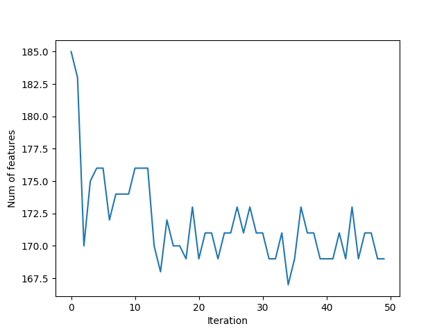

# ML2

# Отбор информативных признаков
## Генетический алгоритм

Информативные признаки - те, что наиболее сильно влияют на результаты обучаемой модели. Используя только оные,т.е, произведя отбор признаков и уменьшение их в исходном датасете, мы можем эффективно уменшить признаковое пространство, избавившись от ненужных данных, не теряя качества классификации, например, или не увеличивая ошибку в задачах регрессии. 

Генетический алгоритм начинается со стартовой популяции, которая состоит из набора хромосом (векторов - решений), где каждая хромосома имеет последовательность генов.

Ген в GA - строительный блок хромосомы. Для нашей задачи - гены и есть признаки. Задачи состоит в отборе оных. В используемом датасете находится 360 признаков, соответственно - 360 генов в хромосоме. Представление гена выберем бинарное (присутствует в хромосоме или нет). 


Используя функцию приспособленности, GA выбирает лучшие решения в качестве родителей для создания новой популяции, а "плохие" - "убивает". Новые решения в новой популяции создаются применением двух операций над родителями - кроссовер и мутация. 

Начальную популяцию (их хромосомное представление) мы инициализируем случайно. Это легко делается с помощью NumPy. 


Критерий для выбора родителей - значение приспособленности. Чем выше значение - тем лучше решение. Оно расчитывается с помощью функции приспособленности. Выбранная исходная модель - SVC - следовательно, мы отбираем признаки для улучшения точности классификации. Она же и будет критерием приспособленности того или иного решения. SVC будет обучаться на всех элементах обучающей выборки ТОЛЬКО с определёнными признаками.

#### Кроссовер и мутация
Опираясь на значение ФП, фильтруем решения, выбираем лучшие. GA предполагает, что совмещение двух хороших решений даст новое лучшее. Здесь и применяется кроссовер - обмен родителей определёнными генами. Был использован одноточечный кроссовер, в котором определённая точка разделяет хромосому. Гены перед оной берутся из первого решения, после - из второго. Новая популяция для новой итерации состоит из предыдущих родителей и их потомства. 


Мутации в данной реализации - случайное обращение некоторых генов.

### Реализация

Извлекаем данные из запакованного в pickle части датасета Fruits360 (содержит 2000 объектов с 360 признаками, 8 классов)

```python
f = open("dataset_features.pkl", "rb")
data_inputs = pickle.load(f)
f.close()

f = open("outputs.pkl", "rb")
data_outputs = pickle.load(f)
f.close()

num_samples = data_inputs.shape[0]
num_feature_elements = data_inputs.shape[1]
train_indices = numpy.arange(1, num_samples, 4)
test_indices = numpy.arange(0, num_samples, 4)
print("Number of training samples: ", train_indices.shape[0])
print("Number of test samples: ", test_indices.shape[0])

"""
Параметры GA:
    размер популяции
    размер пула для "спаривания"
    количество мутаций
"""

sol_per_pop = 8 # размер популяции
num_parents_mating = 4 # Количество родителей в пуле.
num_mutations = 3
# Определяем размеры популяции.
pop_shape = (sol_per_pop, num_feature_elements)
 
# Создание начальной популяции.
new_population = numpy.random.randint(low=0, high=2, size=pop_shape)
print(new_population.shape)
 
best_outputs = []
num_generations = 100 #количество итераций (поколений)
```

```python
for generation in range(num_generations):
    print("Generation : ", generation)
    # Рассчитываем приспособленность для каждой хромосомы в популяции
    fitness = GA.cal_pop_fitness(new_population, data_inputs, data_outputs, train_indices, test_indices)

    best_outputs.append(numpy.max(fitness))
    # Точность классификации лучшего решения данной популяции.
    print("Best result : ", best_outputs[-1])

    # Выбор лучших родителей.
    parents = GA.select_mating_pool(new_population, fitness, num_parents_mating)

    # Генерация следующего поколения с помощью кроссовера.
    offspring_crossover = GA.crossover(parents, offspring_size=(pop_shape[0]-parents.shape[0], num_feature_elements))

    # Применение мутаций.
    offspring_mutation = GA.mutation(offspring_crossover, num_mutations=num_mutations)

    # Создание новой популяции, родители + потомство.
    new_population[0:parents.shape[0], :] = parents
    new_population[parents.shape[0]:, :] = offspring_mutation
```
#### Методы в GA.py

```python
#Обучаем SVC на отобранных признаках
def cal_pop_fitness(pop, features, labels, train_indices, test_indices):
    accuracies = numpy.zeros(pop.shape[0])
    idx = 0

    for curr_solution in pop:
        reduced_features = reduce_features(curr_solution, features)
        train_data = reduced_features[train_indices, :]
        test_data = reduced_features[test_indices, :]

        train_labels = labels[train_indices]
        test_labels = labels[test_indices]

        SV_classifier = sklearn.svm.SVC(gamma='scale')
        SV_classifier.fit(X=train_data, y=train_labels)

        predictions = SV_classifier.predict(test_data)
        accuracies[idx] = classification_accuracy(test_labels, predictions)
        idx = idx + 1
    return accuracies

def crossover(parents, offspring_size):
    offspring = numpy.empty(offspring_size)
    # Точка для кроссовера и разделения генов, обычно - центр
    crossover_point = numpy.uint8(offspring_size[1]/2)

    for k in range(offspring_size[0]):
        # Индексы родителей
        parent1_idx = k%parents.shape[0]
        parent2_idx = (k+1)%parents.shape[0]
        offspring[k, 0:crossover_point] = parents[parent1_idx, 0:crossover_point]
        # Первую половину генов получаем от первого родителя, вторую - от второго
        offspring[k, crossover_point:] = parents[parent2_idx, crossover_point:]
    return offspring


def mutation(offspring_crossover, num_mutations=2):
    mutation_idx = numpy.random.randint(low=0, high=offspring_crossover.shape[1], size=num_mutations)
    # Мутации случайно свапают значения генов
    for idx in range(offspring_crossover.shape[0]):
        offspring_crossover[idx, mutation_idx] = 1 - offspring_crossover[idx, mutation_idx]
    return offspring_crossover
```


### Результаты





# Решающие деревья

Главная задача решающих деревьев состоит в классификации данных и, соответственно, аппроксимации заданной булевой функции. Признаки объектов выборки являются параметрами той самой частично заданной исходной функции *f*. Решающее дерево содержит метки:

* в узлах, не являющихся листьями: признаки, по которым различаются объекты
* В листьях: значения целевой функции
- На рёбрах: значения признака, из которого исходит ребро


Чтобы классифицировать новый объект, нужно спуститься по дереву до листа и выдать соответствующее значение

### Алгоритм построения

Выбираем очередной признак *Q*, помещаем его в корень

Для всех его значений *i*:

        Оставляем из тестовых объектов только те, у которых значение *Q = i*
        
        Рекурсивно строим дерево на этом "потомке"
    
### Энтропия

Предположим, что имеется множество *A* из *n* элементов, *m* из которых обладают некоторым свойством *S*. Тогда энтропия множества *A* по отношению к свойству *S* - это


Энтропия зависит от пропорции, в котором разделяется множество. Чем "ровнее" поделили, тем больше энтропия.

Если свойство *S* - не бинарное, а может принимать *s* различных значений, каждое из которых реализуется в  случаях, то


Энтропия - среднее количество битов, которые требуютяс для кодировки признака *S* у элемента множества *A*.

### Прирост информации

Признак для  классификации нужно выбирать так, чтобы после классификации энтропия (относительно целевой функции) стала как можно меньше.

Предположим, что множество *A* элементов, характеризующихся свойством *S*, классифицировано с помощью признака *Q*, имеющего *q* значений. Тогда прирост информации (information gain) определяется:


где  - множество элементов *A*, на которых признак *Q* имеет значение *i*

## Собственно, ID3


1. Создать корень дерева
2. Если *S* выполняется на всех элементах *A*, поставить в корень метку 1 и выйти.
    * Если *S* не выполняется ни на одном эл-те *A*, поставить в корень метку 0 и выйти. 
    * Если *Q = 0*, то :
        * Если *S* выполняется на половине или большей части *A*, поставить в корень метку 1 и выйти.
        * Иначе, поставить в корень метку 0 и выйти.
3. Выбрать , для которого  максимален
4. Поставить в корень метку *Q*
5. Для каждого значения *q* признака *Q*:
    * Добавить нового потомка корня и пометить соответствующее исходящее ребро меткой *q*
    * Если в *A* нет элементов, где *Q = q* , то пометить этого потомка в зависимости от того, на какой части *A* выполняется *S* (аналогично п.1)
    * Иначе запустить  и добавить его результат как поддерево с корнем в этом потомке
    
### Реализация

Был взят датасет German Credit, 1000 элементов, признаков 20 (7 numerical, 13 categorical)

Attribute 1:  (qualitative)
	       Status of existing checking account
               A11 :      ... <    0 DM
	       A12 : 0 <= ... <  200 DM
	       A13 :      ... >= 200 DM /
		     salary assignments for at least 1 year
               A14 : no checking account

Attribute 2:  (numerical)
	      Duration in month

Attribute 3:  (qualitative)
	      Credit history
	      A30 : no credits taken/
		    all credits paid back duly
              A31 : all credits at this bank paid back duly
	      A32 : existing credits paid back duly till now
              A33 : delay in paying off in the past
	      A34 : critical account/
		    other credits existing (not at this bank)

Attribute 4:  (qualitative)
	      Purpose
	      A40 : car (new)
	      A41 : car (used)
	      A42 : furniture/equipment
	      A43 : radio/television
	      A44 : domestic appliances
	      A45 : repairs
	      A46 : education
	      A47 : (vacation - does not exist?)
	      A48 : retraining
	      A49 : business
	      A410 : others

|                                     |                   |                |         |               |                       |                          |                                                     |                         |                            |                         |          |              |                         |         |                                         |      |                                                          |           |                |        | 
|-------------------------------------|-------------------|----------------|---------|---------------|-----------------------|--------------------------|-----------------------------------------------------|-------------------------|----------------------------|-------------------------|----------|--------------|-------------------------|---------|-----------------------------------------|------|----------------------------------------------------------|-----------|----------------|--------| 
| Status of existing checking account | Duration in month | Credit history | Purpose | Credit amount | Savings account/bonds | Present employment since | Installment rate in percentage of disposable income | Personal status and sex | Other debtors / guarantors | Present residence since | Property | Age in years | Other installment plans | Housing | Number of existing credits at this bank | Job  | Number of people being liable to provide maintenance for | Telephone | foreign worker | target | 
| A11                                 | 6                 | A34            | A43     | 1169          | A65                   | A75                      | 4                                                   | A93                     | A101                       | 4                       | A121     | 67           | A143                    | A152    | 2                                       | A173 | 1                                                        | A192      | A201           | 1      | 
| A12                                 | 48                | A32            | A43     | 5951          | A61                   | A73                      | 2                                                   | A92                     | A101                       | 2                       | A121     | 22           | A143                    | A152    | 1                                       | A173 | 1                                                        | A191      | A201           | 2      | 
| A14                                 | 12                | A34            | A46     | 2096          | A61                   | A74                      | 2                                                   | A93                     | A101                       | 3                       | A121     | 49           | A143                    | A152    | 1                                       | A172 | 2                                                        | A191      | A201           | 1      | 
| A11                                 | 42                | A32            | A42     | 7882          | A61                   | A74                      | 2                                                   | A93                     | A103                       | 4                       | A122     |


Узлом "победителем" будет оный с максимальным приростом информации (IGain), повторяем процесс для поиска признака по которому мы будем разбивать данные в узлах. Функция ниже:
```python
def ID3(data):
	splitting_attribute = None
	split_point = None
	max_gain = 0.0
	info_d = globalFunc.calculate_info_d(data['target'])
	
	for attribute in data.columns:
		if attribute != 'target' and len(data[attribute].unique()) > 1:
			gain, temp_split_point = globalFunc.calculate_information_gain(data, attribute, info_d)
			if gain > max_gain:
				max_gain = gain
				splitting_attribute = attribute
				split_point = temp_split_point
	return splitting_attribute, split_point
```
Небольшой препроцессинг данных
```python
def preprocess(data):
	for column in data.columns:
		if len(data[column].unique()) <= 13:
			data[column] = data[column].astype(object)
	equiv = {1: 'good', 2: 'bad'}
	data['target'] = data['target'].map(equiv)
	return data
```
Считаем IGain

```python
def calculate_information_gain(data, attribute, info_d):
	attr_type = str(data[attribute].dtype)
	if attr_type.find('int') != -1 or attr_type.find('float') != -1:
		info_attribute_d, split_point = info_d_for_continuous_attribute(data, attribute)
		gain = info_d - info_attribute_d
		return gain, split_point
	else:
		info_attribute_d = info_d_for_nominal_attributes(data,attribute)
		gain = info_d - info_attribute_d
		return gain,None
```

Метод генерации самого дерева
```python
## Присваиваем лучший разбиваемый атрибут текущему узлу
root.data = splitting_attribute
if split_point == None:
	values = data[splitting_attribute].unique()

	## разбиваем данные на все возможные значения разделяемого атрибута и рекурсивно индуцируем дерево 
	for value in values:
		root.link_name.append(value)
		root.link.append(self.create_tree(data[data[splitting_attribute] == value].drop([splitting_attribute],1),algo))

else:
	root.split_point = split_point
	root.link_name.append(' A <=' + str(split_point))
	root.link.append(self.create_tree(data[data[splitting_attribute] <= split_point].drop([splitting_attribute],1),algo))
	root.link_name.append('A > '+ str(split_point))
	root.link.append(self.create_tree(data[data[splitting_attribute] >  split_point].drop([splitting_attribute],1),algo))
return root

```
Полученное дерево при фракции обучающих данных в 60%, визуализация thru GraphViz


## C4.5, the Great and the Mighty

C4.5 является усовершенствованной версией алгоритма ID3 того же автора. В частности, в новую версию были добавлены отсечение ветвей (pruning), возможность работы с числовыми признаками, а также возможность построения дерева из неполной обучающей выборки, в которой отсутствуют значения некоторых признаками.

#### Ограничения, требования к данным:

1. **Описание признаков.** Данные в виде плоской таблицы. Объекты - конечный набор признаков, которые имеют дискретное или числовое значение. Количество признаков должно быть фиксированным для всех объектов.
2. **Определенные классы.** Каждый объект должен быть ассоциирован с конкретным классом, т.е. один из признаков должен быть выбран в качестве метки класса.

Сам алгоритм:
Алгоритм строит деревья аналогично ID3, используя концепцию энтропии. Обучающая выборка - набор  уже классифицированых объектов. Каждый объект  состоит из p-мерного вектора  признаков.

В каждом узле дерева алгоритм выбирает признак данных, который наиболее эффективно разбивает множество на подмножества наполненные одним классом или другим. Критерий разбиения - нормализованный прирост информации (IGain). Как и ранее, признак с наибольшим IG выбирается для решений. Алгоритм далее рекурсирует по разбитым подмножествам.


### Реализация

Собственно, для анализа и сравнения двух алгоритмов использовался один и тот же датасет.
Сам метод алгоритма C4.5:

```python
def C45(data):
	splitting_attribute = None
	max_gain_ratio = 0.0
	split_point = None
	info_d = globalFunc.calculate_info_d(data['target'])
	for attribute in data.columns:
		if attribute != 'target' and len(data[attribute].unique()) > 1:
			gain_ratio, temp_split_point = globalFunc.calculate_gain_ratio(data, attribute, info_d)
			if gain_ratio > max_gain_ratio:
				max_gain_ratio = gain_ratio
				splitting_attribute = attribute
				split_point = temp_split_point
	return splitting_attribute, split_point
```
Считаем процент IGain
```python
def calculate_gain_ratio(data, attribute, info_d):
	gain, split_point = calculate_information_gain(data, attribute, info_d)
	split_info = calculate_split_info(data, attribute)
	gain_ratio = gain / split_info
	return gain_ratio, split_point
```
Сам общий эстимейтор
```python
def estimate(row,dtree):
	if len(dtree.link) == 0:
		return dtree.data
	for (ln,l) in zip(dtree.link_name,dtree.link):
		if dtree.split_point != None:
			if row[dtree.data] <= dtree.split_point and str(ln).find('<') != -1:
				return estimate(row,l)
			elif row[dtree.data] > dtree.split_point and str(ln).find('>') != -1:
				return estimate(row,l)
		elif row[dtree.data] == ln:
			return estimate(row,l)
```   
Основной метод (почти)

#### Результат

Визуализация аналогична ID3, деревья получились большие...


### Сравнение
[Сравнение тут, спасибо GithubPages за хост](https://zoncker.github.io/ML2/ "asd")


## Метод поиска в глубину и ширину

### DFS(Branch and bound)

1. Нумерация признаков по возрастанию номеров —
чтобы избежать повторов при переборе подмножеств
2. если набор *J* бесперспективен, то больше не пытаться его наращивать.

 - значение критерия на самом лучшем наборе мощности *j* из всех до сих пор просмотренных.

Оценка бесперспективности набора признаков *J*: набор J не наращивается, если

 и 

 - целочисленный параметр, 

 - вещественный параметр.

Чем меньше  и , тем сильнее сокращается перебор.

Вход: множество , критерий , параметры 

Нарастить (J)

**если** найдётся , то 

выход


Инициализация массива лучших значений критерия:


Упорядочить признаки по убыванию информативности

Нарастить 

Вернуть *J*, для которого 

#### Реализация

Всё те же ирисы, критерий - CV конкретного признака.
```python
def criterion_function(features):

    X_train, X_test, y_train, y_test = train_test_split(iris.data[:, features],
                                                        iris.target, test_size=0.4, random_state=0)
    knn = KNeighborsClassifier(n_neighbors=3).fit(X_train, y_train)
    result = cross_val_score(knn, iris.data[:, features], iris.target, cv=5)
    return max(result)
```
Основной метод алгоритма:
```python
def branch_and_bound(root, D, d):
    global flag
    global J_max
    global result_node

    # Начальное вычисление критерия в корне
    root.J = criterion_function(root.features)

    # Не наращивать набор (ветвиться от этого узла) если J <= J_max
    if flag == False and root.J <= J_max:
        return

    #Если это лист, обновить J_max, result_node и выйти
    if root.level == D - d:
        if flag == True:
            J_max = root.J
            flag = False
            result_node = root

        elif root.J > J_max:
            J_max = root.J
            result_node = root

        return
```
Считаем количество ветвей этого узла
```python
    no_of_branches = (d + 1) - len(root.preserved_features)

    # Генерим эти ветви
    branch_feature_values = sorted(
        random.sample(list(set(root.features) - set(root.preserved_features)), no_of_branches))

    #Итерируем по ветвям, и для каждой ветви рекурсивно коллим метод
    for i, branch_value in enumerate(branch_feature_values):
        child = tree_node(branch_value, [value for value in root.features if value != branch_value], \
                          root.preserved_features + branch_feature_values[i + 1:], root.level + 1)

        root.children.append(child)

        branch_and_bound(child, D, d)
```
Собственно, отрисовка дерева
```python
def display_tree(node, dot_object, parent_index):
    iris = datasets.load_iris()
    for i in node.features:
        node.name.append(iris.feature_names[i])

    #Создать узел в дереве
    dot_object.node(str(node.index),
                    "Features = " + str(node.name) + "\nJ(Features) = " + str(node.J) + "\nPreserved = " + str(
                        node.preserved_features))

    #Если не корень, то создать ветвь к родителю
    if node.index != -1:
        dot_object.edge(str(parent_index), str(node.index), label=str(node.branch_value))

    # базовый случай, когда у узла нет потомков, выйти 
    if len(node.children) == 0:
        return

    # рекурсивный колл метода для всех потомков этого узла
    for child in reversed(node.children):
        display_tree(child, dot_object, node.index)
```


### BFS

Он же многорядный итерационный алгоритм МГУА (МГУА — метод группового учёта аргументов)

Философия — принцип неокончательных решений Габора:

принимая решения, следует оставлять максимальную свободу выбора для принятия последующих решений.

Усовершенствуем алгоритм Add:

на каждой *j*-й итерации будем строить не один набор, а множество из  наборов, называемое *j*-м рядом:


где 

Вход: множество *F*, критерий *Q*, параметры *d*, *B*

первый ряд состоит из всех наборов длины 1:


 где j - сложность наборов:

отсортировать ряд 

по возрастанию критерия: 


 - *B* лучших наборов ряда;


породить следующий ряд:


Трудоёмкость:

 точнее 

Проблема дубликатов:

после сортировки (шаг 3) проверить на совпадение только соседние наборы с равными значениями внутреннего и внешнего критерия.

Адаптивный отбор признаков:

на шаге 8 добавлять к j-му ряду только признаки *f* с наибольшей информативностью  


### Exhaustive Feature Selection

Вход: множество *F*, критерий *Q*, параметры *d*

 - инициализация

, где *j* - сложность наборов

найти лучший набор сложности *j*:


if  

if  то вернуть 

Преимущества
- простота реализации
- гарантированный результат
- полный перебор эффективен когда
  - информативных признаков не много, 
  - всего признаков не много, 
  
Недостатки:
- В остальных случаях ооочень долго - 

- чем больше перебирается вариантов, тем больше переобучение (особенно, если лучшие из вариантов существенно различны и одинаково плохи)

### Реализация

***Irises, irises never change.***

Собсна, нашим критерий - скоринг точности CV на KNN.
```python
def _calc_score(selector, X, y, indices, **fit_params):
    if selector.cv:
        scores = cross_val_score(selector.est_,
                                 X[:, indices], y,
                                 cv=selector.cv,
                                 scoring=selector.scorer,
                                 n_jobs=1,
                                 pre_dispatch=selector.pre_dispatch,
                                 fit_params=fit_params)
    else:
        selector.est_.fit(X[:, indices], y, **fit_params)
        scores = np.array([selector.scorer(selector.est_, X[:, indices], y)])
    return indices, scores
```
Количество комбинаций признаков длины r из n.
```python
r = min(r, n-r)
if r == 0:
return 1
numer = reduce(op.mul, range(n, n-r, -1))
denom = reduce(op.mul, range(1, r+1))
return numer//denom

all_comb = np.sum([ncr(n=X_.shape[1], r=i)
		   for i in range(self.min_features,
				  self.max_features + 1)])
```
Производим отбор признаков и обучение модели на выборке
```python
candidates = chain(*((combinations(range(X_.shape[1]), r=i))
		   for i in range(self.min_features,
				  self.max_features + 1)))
self.subsets_[iteration] = {'feature_idx': c,
			    'cv_scores': cv_scores,
			    'avg_score': np.mean(cv_scores)}

max_score = float('-inf')
for c in self.subsets_:
    if self.subsets_[c]['avg_score'] > max_score:
	max_score = self.subsets_[c]['avg_score']
	best_subset = c
score = max_score
idx = self.subsets_[best_subset]['feature_idx']

self.best_idx_ = idx
self.best_score_ = score
self.fitted = True
self.subsets_, self.best_feature_names_ = \
    _get_featurenames(self.subsets_,
		      self.best_idx_,
		      custom_feature_names,
		      X)
```
Получаем словарь где каждое значение - список с кол-вом итераций (кол-во подвыборок признаков) как его длины. Ключи словаря соответствуют спискам.
```python
    def get_metric_dict(self, confidence_interval=0.95):
        fdict = deepcopy(self.subsets_)
        for k in fdict:
            std_dev = np.std(self.subsets_[k]['cv_scores'])
            bound, std_err = self._calc_confidence(
                self.subsets_[k]['cv_scores'],
                confidence=confidence_interval)
            fdict[k]['ci_bound'] = bound
            fdict[k]['std_dev'] = std_dev
            fdict[k]['std_err'] = std_err
        return fdict

    def _calc_confidence(self, ary, confidence=0.95):
        std_err = scipy.stats.sem(ary)
        bound = std_err * sp.stats.t._ppf((1 + confidence) / 2.0, len(ary))
        return bound, std_err
```


Best accuracy score: 0.97
Best subset (indices): (0, 2, 3)
Best subset (corresponding names): ('sepal length', 'petal length', 'petal width')
