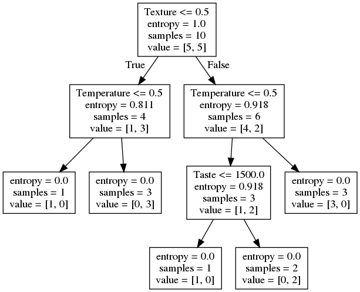

# ML2

# Отбор информативных признаков
## Генетический алгоритм

Информативные признаки - те, что наиболее сильно влияют на результаты обучаемой модели. Используя только оные,т.е, произведя отбор признаков и уменьшение их в исходном датасете, мы можем эффективно уменшить признаковое пространство, избавившись от ненужных данных, не теряя качества классификации, например, или не увеличивая ошибку в задачах регрессии. 

Генетический алгоритм начинается со стартовой популяции, которая состоит из набора хромосом (векторов - решений), где каждая хромосома имеет последовательность генов.

Ген в GA - строительный блок хромосомы. Для нашей задачи - гены и есть признаки. Задачи состоит в отборе оных. В используемом датасете находится 360 признаков, соответственно - 360 генов в хромосоме. Представление гена выберем бинарное (присутствует в хромосоме или нет). 


Используя функцию приспособленности, GA выбирает лучшие решения в качестве родителей для создания новой популяции, а "плохие" - "убивает". Новые решения в новой популяции создаются применением двух операций над родителями - кроссовер и мутация. 

Начальную популяцию (их хромосомное представление) мы инициализируем случайно. Это легко делается с помощью NumPy. 


Критерий для выбора родителей - значение приспособленности. Чем выше значение - тем лучше решение. Оно расчитывается с помощью функции приспособленности. Выбранная исходная модель - SVC - следовательно, мы отбираем признаки для улучшения точности классификации. Она же и будет критерием приспособленности того или иного решения. SVC будет обучаться на всех элементах обучающей выборки ТОЛЬКО с определёнными признаками.

#### Кроссовер и мутация
Опираясь на значение ФП, фильтруем решения, выбираем лучшие. GA предполагает, что совмещение двух хороших решений даст новое лучшее. Здесь и применяется кроссовер - обмен родителей определёнными генами. Был использован одноточечный кроссовер, в котором определённая точка разделяет хромосому. Гены перед оной берутся из первого решения, после - из второго. Новая популяция для новой итерации состоит из предыдущих родителей и их потомства. 


Мутации в данной реализации - случайное обращение некоторых генов.

### Реализация

Извлекаем данные из запакованного в pickle части датасета Fruits360 (содержит 2000 объектов с 360 признаками, 8 классов)

```python
f = open("dataset_features.pkl", "rb")
data_inputs = pickle.load(f)
f.close()

f = open("outputs.pkl", "rb")
data_outputs = pickle.load(f)
f.close()

num_samples = data_inputs.shape[0]
num_feature_elements = data_inputs.shape[1]
train_indices = numpy.arange(1, num_samples, 4)
test_indices = numpy.arange(0, num_samples, 4)
print("Number of training samples: ", train_indices.shape[0])
print("Number of test samples: ", test_indices.shape[0])

"""
Параметры GA:
    размер популяции
    размер пула для "спаривания"
    количество мутаций
"""

sol_per_pop = 8 # размер популяции
num_parents_mating = 4 # Количество родителей в пуле.
num_mutations = 3
# Определяем размеры популяции.
pop_shape = (sol_per_pop, num_feature_elements)
 
# Создание начальной популяции.
new_population = numpy.random.randint(low=0, high=2, size=pop_shape)
print(new_population.shape)
 
best_outputs = []
num_generations = 100 #количество итераций (поколений)
```

```python
for generation in range(num_generations):
    print("Generation : ", generation)
    # Рассчитываем приспособленность для каждой хромосомы в популяции
    fitness = GA.cal_pop_fitness(new_population, data_inputs, data_outputs, train_indices, test_indices)

    best_outputs.append(numpy.max(fitness))
    # Точность классификации лучшего решения данной популяции.
    print("Best result : ", best_outputs[-1])

    # Выбор лучших родителей.
    parents = GA.select_mating_pool(new_population, fitness, num_parents_mating)

    # Генерация следующего поколения с помощью кроссовера.
    offspring_crossover = GA.crossover(parents, offspring_size=(pop_shape[0]-parents.shape[0], num_feature_elements))

    # Применение мутаций.
    offspring_mutation = GA.mutation(offspring_crossover, num_mutations=num_mutations)

    # Создание новой популяции, родители + потомство.
    new_population[0:parents.shape[0], :] = parents
    new_population[parents.shape[0]:, :] = offspring_mutation
```
#### Методы в GA.py

```python
#Обучаем SVC на отобранных признаках
def cal_pop_fitness(pop, features, labels, train_indices, test_indices):
    accuracies = numpy.zeros(pop.shape[0])
    idx = 0

    for curr_solution in pop:
        reduced_features = reduce_features(curr_solution, features)
        train_data = reduced_features[train_indices, :]
        test_data = reduced_features[test_indices, :]

        train_labels = labels[train_indices]
        test_labels = labels[test_indices]

        SV_classifier = sklearn.svm.SVC(gamma='scale')
        SV_classifier.fit(X=train_data, y=train_labels)

        predictions = SV_classifier.predict(test_data)
        accuracies[idx] = classification_accuracy(test_labels, predictions)
        idx = idx + 1
    return accuracies

def crossover(parents, offspring_size):
    offspring = numpy.empty(offspring_size)
    # Точка для кроссовера и разделения генов, обычно - центр
    crossover_point = numpy.uint8(offspring_size[1]/2)

    for k in range(offspring_size[0]):
        # Индексы родителей
        parent1_idx = k%parents.shape[0]
        parent2_idx = (k+1)%parents.shape[0]
        offspring[k, 0:crossover_point] = parents[parent1_idx, 0:crossover_point]
        # Первую половину генов получаем от первого родителя, вторую - от второго
        offspring[k, crossover_point:] = parents[parent2_idx, crossover_point:]
    return offspring


def mutation(offspring_crossover, num_mutations=2):
    mutation_idx = numpy.random.randint(low=0, high=offspring_crossover.shape[1], size=num_mutations)
    # Мутации случайно свапают значения генов
    for idx in range(offspring_crossover.shape[0]):
        offspring_crossover[idx, mutation_idx] = 1 - offspring_crossover[idx, mutation_idx]
    return offspring_crossover
```


### Результаты


Selected indices :  [  1   3   4   5   9  11  12  13  22  24  25  26  27  31  32  34  35  36
  39  40  42  45  46  47  48  50  54  55  56  59  62  64  65  66  67  69
  72  73  74  75  76  80  81  82  87  89  90  91  93  97  98 100 102 103
 105 108 109 111 114 116 119 120 122 123 127 128 131 132 133 135 136 144
 146 147 150 151 152 157 159 160 164 165 167 169 172 173 174 175 176 182
 184 186 187 189 191 193 195 197 201 202 203 204 205 207 209 214 215 216
 219 221 223 224 227 229 230 231 232 233 237 238 241 243 244 246 251 253
 255 256 258 259 260 265 268 272 273 278 282 283 284 286 289 295 298 299
 301 302 304 305 307 308 309 310 311 312 314 317 319 320 322 325 326 327
 328 329 330 337 338 340 341 345 346 348 351 355 357 358]


# Решающие деревья

Главная задача решающих деревьев состоит в классификации данных и, соответственно, аппроксимации заданной булевой функции. Признаки объектов выборки являются параметрами той самой частично заданной исходной функции *f*. Решающее дерево содержит метки:

* в узлах, не являющихся листьями: признаки, по которым различаются объекты
* В листьях: значения целевой функции
- На рёбрах: значения признака, из которого исходит ребро


Чтобы классифицировать новый объект, нужно спуститься по дереву до листа и выдать соответствующее значение

### Алгоритм построения

Выбираем очередной признак *Q*, помещаем его в корень

Для всех его значений *i*:

        Оставляем из тестовых объектов только те, у которых значение *Q = i*
        
        Рекурсивно строим дерево на этом "потомке"
    
### Энтропия

Предположим, что имеется множество *A* из *n* элементов, *m* из которых обладают некоторым свойством *S*. Тогда энтропия множества *A* по отношению к свойству *S* - это


Энтропия зависит от пропорции, в котором разделяется множество. Чем "ровнее" поделили, тем больше энтропия.

Если свойство *S* - не бинарное, а может принимать *s* различных значений, каждое из которых реализуется в  случаях, то


Энтропия - среднее количество битов, которые требуютяс для кодировки признака *S* у элемента множества *A*.

### Прирост информации

Признак для  классификации нужно выбирать так, чтобы после классификации энтропия (относительно целевой функции) стала как можно меньше.

Предположим, что множество *A* элементов, характеризующихся свойством *S*, классифицировано с помощью признака *Q*, имеющего *q* значений. Тогда прирост информации (information gain) определяется:


где  - множество элементов *A*, на которых признак *Q* имеет значение *i*

## Собственно, ID3


1. Создать корень дерева
2. Если *S* выполняется на всех элементах *A*, поставить в корень метку 1 и выйти.
    * Если *S* не выполняется ни на одном эл-те *A*, поставить в корень метку 0 и выйти. 
    * Если *Q = 0*, то :
        * Если *S* выполняется на половине или большей части *A*, поставить в корень метку 1 и выйти.
        * Иначе, поставить в корень метку 0 и выйти.
3. Выбрать , для которого  максимален
4. Поставить в корень метку *Q*
5. Для каждого значения *q* признака *Q*:
    * Добавить нового потомка корня и пометить соответствующее исходящее ребро меткой *q*
    * Если в *A* нет элементов, где *Q = q* , то пометить этого потомка в зависимости от того, на какой части *A* выполняется *S* (аналогично п.1)
    * Иначе запустить  и добавить его результат как поддерево с корнем в этом потомке
    
### Реализация

Используя достаточно простой датасет для построения дерева:

|   |       |             |         |     | 
|---|-------|-------------|---------|-----| 
|   | Taste | Temperature | Texture | Eat | 
| 0 | 1000  | 1           | 1       | 0   | 
| 1 | 2000  | 1           | 1       | 0   | 
| 2 | 3000  | 1           | 0       | 1   | 
| 3 | 2000  | 0           | 0       | 0   | 
| 4 | 1000  | 1           | 0       | 1   | 
| 5 | 3000  | 0           | 1       | 1   | 
| 6 | 1000  | 0           | 1       | 0   | 
| 7 | 3000  | 1           | 1       | 0   | 
| 8 | 2000  | 0           | 1       | 1   | 
| 9 | 1000  | 1           | 0       | 1   | 

Этот же датасет в виде словаря, собираем из него датафрейм Pandas:
```python
dataset = {'Taste': ['1000', '2000', '3000', '2000', '1000', '3000', '1000', '3000', '2000', '1000'],
           'Temperature': ['1', '1', '1', '0', '1', '0', '0', '1', '0', '1'],
           'Texture': ['1', '1', '0', '0', '0', '1', '1', '1', '1', '0'],
           'Eat': ['0', '0', '1', '0', '1', '1', '0', '0', '1', '1']}
df = pd.DataFrame(dataset,columns=['Taste','Temperature','Texture','Eat'])
```
Мы определим функцию которая принимает класс (таргет-вектор) и находит энтропию этого класса. Фракция здесь - отношение кол-ва эл-тов на которое разбивается группа к кол-ву эл-тов в группе перед разделением(родительская группа) 

```python
def find_entropy(df):
    Class = df.keys()[-1]   
    entropy = 0
    values = df[Class].unique()
    for value in values:
        fraction = df[Class].value_counts()[value]/len(df[Class])
        entropy += -fraction*np.log2(fraction)
    return entropy
```
Узлом "победителем" будет оный с максимальным приростом информации (IGain), повторяем процесс для поиска признака по которому мы будем разбивать данные в узлах. Функция ниже:
```python
def find_winner(df):
    Entropy_att = []
    IG = []
    for key in df.keys()[:-1]:
        IG.append(find_entropy(df)-find_entropy_attribute(df,key))
    return df.keys()[:-1][np.argmax(IG)] 
```
Строим решающее дерево, оно строится рекурсивными вызовами этой функции. 
```python
def buildTree(df,tree=None): 
    Class = df.keys()[-1]   #Получаем классы (0,1)
    node = find_winner(df) #Получаем признак с максимальным IGain
    attValue = np.unique(df[node]) #получаем различные значения этого признака
    
    if tree is None: #пустой словарь для самого дерева                 
        tree={}
        tree[node] = {}
  
    for value in attValue:
        #Здесь мы проверяем "чистоту" подмножества и останавливаемся, если да
        subtable = get_subtable(df,node,value)
        clValue,counts = np.unique(subtable['Eat'],return_counts=True)                        
        
        if len(counts)==1:#Checking purity of subset
            tree[node][value] = clValue[0]                                                    
        else:        
            tree[node][value] = buildTree(subtable) #рекурсивный колл
                   
    return tree
```

Полученное дерево, визуализация thru GraphViz



Эта функция позволяет делать прогнозы для любых входных данных

```python
def predict(inst,tree):
    for nodes in tree.keys():        
        
        value = inst[nodes]
        tree = tree[nodes][value]
        prediction = 0
            
        if type(tree) is dict:
            prediction = predict(inst, tree)
        else:
            prediction = tree
            break;                            
        
    return prediction
```

## C4.5, the Great and the Mighty

C4.5 является усовершенствованной версией алгоритма ID3 того же автора. В частности, в новую версию были добавлены отсечение ветвей (pruning), возможность работы с числовыми признаками, а также возможность построения дерева из неполной обучающей выборки, в которой отсутствуют значения некоторых признаками.

#### Ограничения, требования к данным:

1. **Описание признаков.** Данные в виде плоской таблицы. Объекты - конечный набор признаков, которые имеют дискретное или числовое значение. Количество признаков должно быть фиксированным для всех объектов.
2. **Определенные классы.** Каждый объект должен быть ассоциирован с конкретным классом, т.е. один из признаков должен быть выбран в качестве метки класса.

Сам алгоритм:
Алгоритм строит деревья аналогично ID3, используя концепцию энтропии. Обучающая выборка - набор  уже классифицированых объектов. Каждый объект  состоит из p-мерного вектора  признаков.

В каждом узле дерева алгоритм выбирает признак данных, который наиболее эффективно разбивает множество на подмножества наполненные одним классом или другим. Критерий разбиения - нормализованный прирост информации (IGain). Как и ранее, признак с наибольшим IG выбирается для решений. Алгоритм далее рекурсирует по разбитым подмножествам.


### Реализация

"Усложняем" датасет используя ирисы Фишера.

```python
def preprocessData(self):
	for index,row in enumerate(self.data):
		for attr_index in range(self.numAttributes): # итерируем по выборке (матрице объектов-признаков)
			if(not self.isAttrDiscrete(self.attributes[attr_index])): # проверяем значения на дискретность
				self.data[index][attr_index] = float(self.data[index][attr_index])
```
Метод рекурсивной генерации дерева
```python
def recursiveGenerateTree(self, curData, curAttributes):
	allSame = self.allSameClass(curData) #проверям на принадлежность всех элтов классу

	if len(curData) == 0: #Fail
		return Node(True, "Fail", None)
	elif allSame is not False: #если одного класса
		return Node(True, allSame, None) #возвращаем узел с этим классом
	elif len(curAttributes) == 0:
		majClass = self.getMajClass(curData) #возвращаем класс большинства
		return Node(True, majClass, None)
	else: #иначе разбиваем дальше
		(best,best_threshold,splitted) = self.splitAttribute(curData, curAttributes)
		remainingAttributes = curAttributes[:]
		remainingAttributes.remove(best) #удаляем лучший признак
		node = Node(False, best, best_threshold)
		node.children = [self.recursiveGenerateTree(subset, remainingAttributes) for subset in splitted]
		return node #рекурсивный колл от оставшихся признаков в подмножестве
```   
Основной метод (почти)
```python
def splitAttribute(self, curData, curAttributes):
	splitted = []
	maxEnt = -1*float("inf")
	best_attribute = -1
	#None для дискретных признаков, пороговое значение для непрерывных признаков
	best_threshold = None
	for attribute in curAttributes:
		indexOfAttribute = self.attributes.index(attribute)
		if self.isAttrDiscrete(attribute): 
		#разбиваем curData в n подмн-в где n - кол-во разных значений признака 
			valuesForAttribute = self.attrValues[attribute] 
			subsets = [[] for a in valuesForAttribute]
			for row in curData:
				for index in range(len(valuesForAttribute)):
					if row[i] == valuesForAttribute[index]:
						subsets[index].append(row)
						break
			e = gain(curData, subsets)#выбираем признак с max IGain
			if e > maxEnt:
				maxEnt = e
				splitted = subsets
				best_attribute = attribute
				best_threshold = None
		else:  #сортируем данные согласно столбцам, после пробуем все возможные смежные пары
		# выбираем тот, что даёт max IGain
			curData.sort(key = lambda x: x[indexOfAttribute])
			for j in range(0, len(curData) - 1):
				if curData[j][indexOfAttribute] != curData[j+1][indexOfAttribute]:
					threshold = (curData[j][indexOfAttribute] + curData[j+1][indexOfAttribute]) / 2
					less = []
					greater = []
					for row in curData:
						if(row[indexOfAttribute] > threshold):
							greater.append(row)
						else:
							less.append(row)
					e = self.gain(curData, [less, greater])
					if e >= maxEnt:
						splitted = [less, greater]
						maxEnt = e
						best_attribute = attribute
						best_threshold = threshold
	return (best_attribute,best_threshold,splitted)
```

#### Результат


	petal width <= 0.8 : Iris-setosa

	petal width > 0.8 : 

		petal length <= 4.75 : 

			sepal length <= 4.95 : 

				sepal width <= 2.45 : Iris-versicolor

				sepal width > 2.45 : Iris-virginica

			sepal length > 4.95 : Iris-versicolor

		petal length > 4.75 : 

			sepal length <= 7.0 : 
			
				sepal width <= 3.25 : Iris-virginica
				
				sepal width > 3.25 : Iris-virginica
				
			sepal length > 7.0 : Iris-virginica


```python
from sklearn.datasets import load_iris
from sklearn import tree

clf = tree.DecisionTreeClassifier(max_depth=3, criterion="entropy")
iris = load_iris()
clf = clf.fit(iris.data, iris.target)
tree.export_graphviz(clf, out_file='tree.dot', feature_names=iris.feature_names)
```
Небольшой пример обучения и визуализации решающего дерева с помощью sklearn и GraphViz.

```bash
$ dot -Tpng tree.dot -o tree.png 
```
Экспорт .dot объекта в .png-изображение выше.


## Метод поиска в глубину и ширину

### DFS(Branch and bound)

1. Нумерация признаков по возрастанию номеров —
чтобы избежать повторов при переборе подмножеств
2. если набор *J* бесперспективен, то больше не пытаться его наращивать.

 - значение критерия на самом лучшем наборе мощности *j* из всех до сих пор просмотренных.

Оценка бесперспективности набора признаков *J*: набор J не наращивается, если

 и 

 - целочисленный параметр, 

 - вещественный параметр.

Чем меньше  и , тем сильнее сокращается перебор.

Вход: множество , критерий , параметры 

Нарастить (J)

**если** найдётся , то 

выход


Инициализация массива лучших значений критерия:


Упорядочить признаки по убыванию информативности

Нарастить 

Вернуть *J*, для которого 


### BFS

Он же многорядный итерационный алгоритм МГУА (МГУА — метод группового учёта аргументов)

Философия — принцип неокончательных решений Габора:

принимая решения, следует оставлять максимальную свободу выбора для принятия последующих решений.

Усовершенствуем алгоритм Add:

на каждой *j*-й итерации будем строить не один набор, а множество из  наборов, называемое *j*-м рядом:


где 

Вход: множество *F*, критерий *Q*, параметры *d*, *B*

первый ряд состоит из всех наборов длины 1:


 где j - сложность наборов:

отсортировать ряд 

по возрастанию критерия: 


 - *B* лучших наборов ряда;


породить следующий ряд:


Трудоёмкость:

 точнее 

Проблема дубликатов:

после сортировки (шаг 3) проверить на совпадение только соседние наборы с равными значениями внутреннего и внешнего критерия.

Адаптивный отбор признаков:

на шаге 8 добавлять к j-му ряду только признаки *f* с наибольшей информативностью  


### Exhaustive Feature Selection

Вход: множество *F*, критерий *Q*, параметры *d*

 - инициализация

, где *j* - сложность наборов

найти лучший набор сложности *j*:


if  

if  то вернуть 

Преимущества
- простота реализации
- гарантированный результат
- полный перебор эффективен когда
  - информативных признаков не много, 
  - всего признаков не много, 
  
Недостатки:
- В остальных случаях ооочень долго - 

- чем больше перебирается вариантов, тем больше переобучение (особенно, если лучшие из вариантов существенно различны и одинаково плохи)

Способы устранения
-эвристические методы сокращённого перебора
